

10-second tour: Camera → Detect → Classify → Advise → Overlay

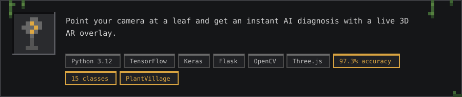


<h2></h2>

<h2>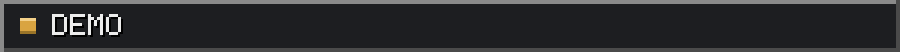</h2>

<h2>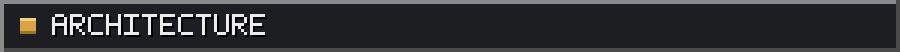</h2>

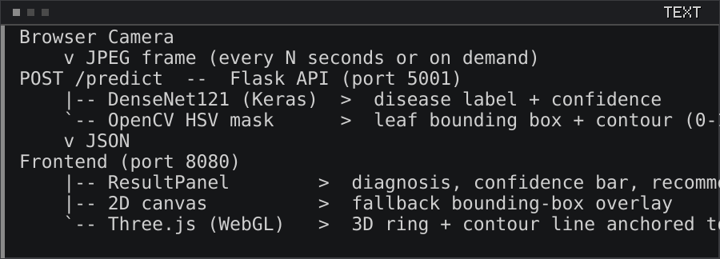

<h2></h2>

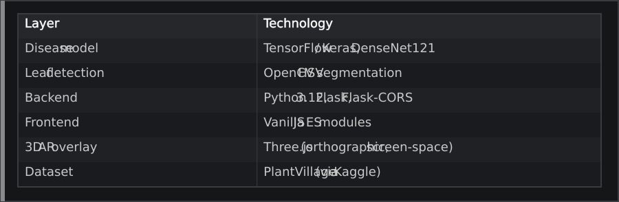

<h2></h2>

<h3></h3>

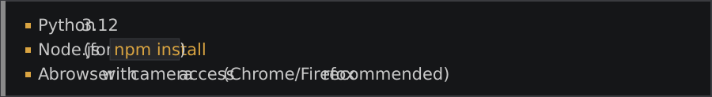

<h3>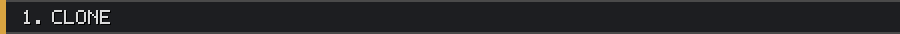</h3>

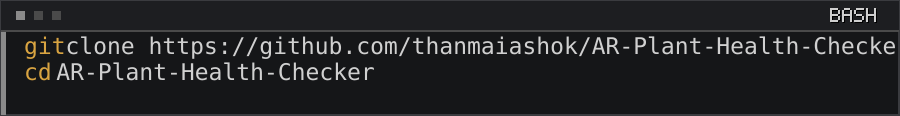

<h3></h3>

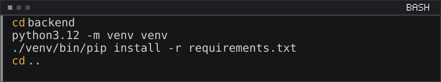

<h3></h3>

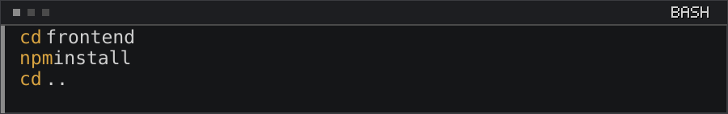

<h3>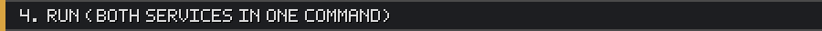</h3>

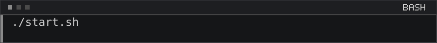

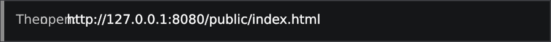

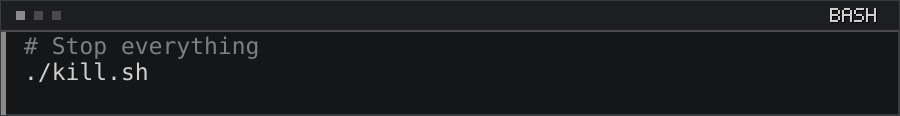

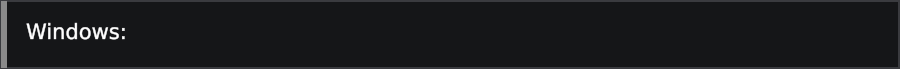

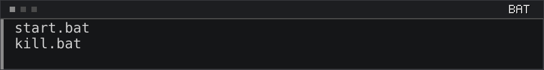

<h3>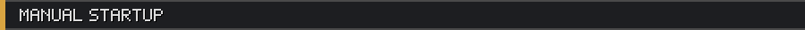</h3>

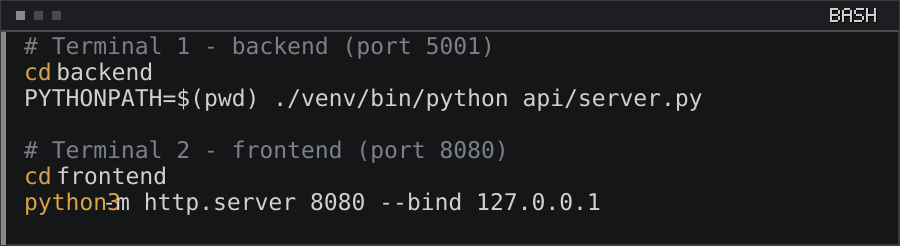

<h2>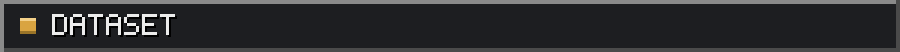</h2>

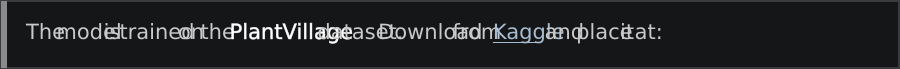

<a href="https://www.kaggle.com/datasets/abdallahalidev/plantvillage-dataset">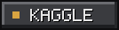</a>

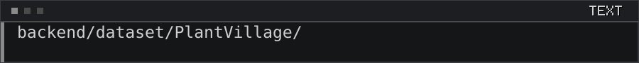

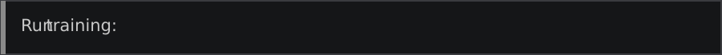

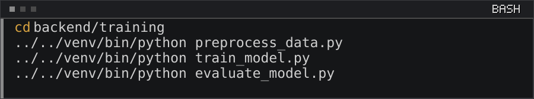

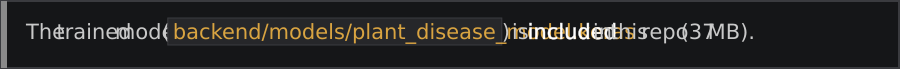

<h2>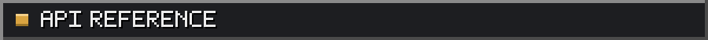</h2>

<h3></h3>

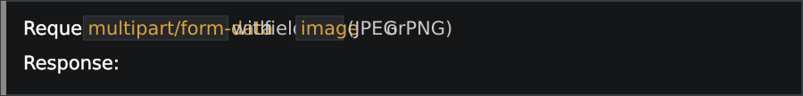

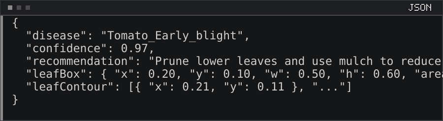

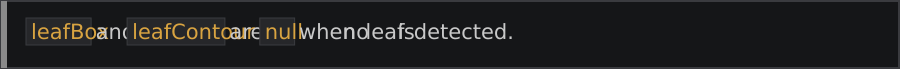

<h3></h3>

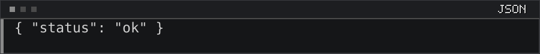

<h2></h2>

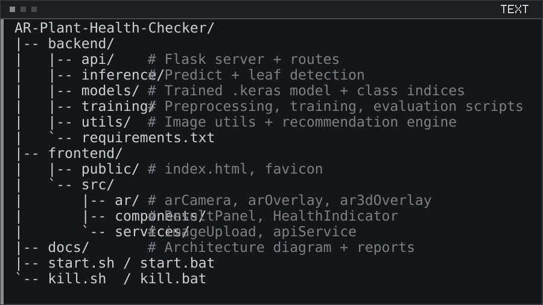

<h2></h2>

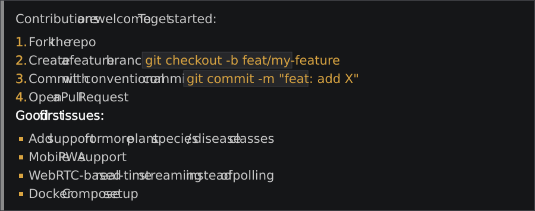

<h2></h2>

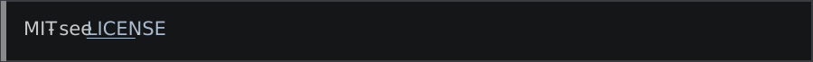

<h2>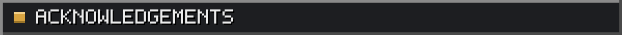</h2>

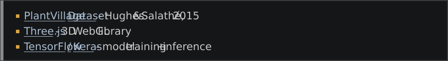

<a href="https://www.kaggle.com/datasets/abdallahalidev/plantvillage-dataset">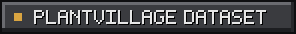</a> <a href="https://threejs.org/">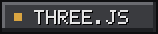</a> <a href="https://www.tensorflow.org/">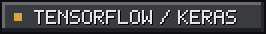</a>

