<p align="center"></p>

<p align="center"><sub>10-second tour: Camera → Detect → Classify → Advise → Overlay</sub></p>

<p align="center">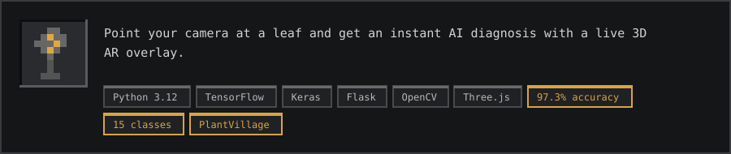</p>

<p align="center"></p>

<a id="what-it-does"></a>
<h2></h2>

1. Opens your device camera in the browser
2. Detects the leaf's bounding box using OpenCV HSV segmentation
3. Classifies the disease (or healthy) with a DenseNet121 model trained on PlantVillage
4. Draws a color-coded **3D AR overlay** (Three.js ring + contour) anchored to the detected leaf
5. Shows diagnosis, confidence score, and treatment recommendation in a result panel

**Supports 15 disease classes across 3 plants:**

| Plant | Conditions |
|---|---|
| Tomato | Bacterial spot, Early blight, Late blight, Leaf mold, Septoria leaf spot, Spider mites, Target spot, Yellow Leaf Curl Virus, Mosaic virus, Healthy |
| Potato | Early blight, Late blight, Healthy |
| Pepper bell | Bacterial spot, Healthy |

<a id="demo"></a>
<h2>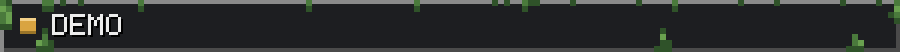</h2>


<a id="architecture"></a>
<h2></h2>

```
Browser Camera
    ↓ JPEG frame (every N seconds or on demand)
POST /predict  ──  Flask API (port 5001)
    ├── DenseNet121 (Keras)  →  disease label + confidence
    └── OpenCV HSV mask      →  leaf bounding box + contour (0–1 normalised)
    ↓ JSON
Frontend (port 8080)
    ├── ResultPanel        →  diagnosis, confidence bar, recommendation
    ├── 2D canvas          →  fallback bounding-box overlay
    └── Three.js (WebGL)   →  3D ring + contour line anchored to leaf
```

<a id="tech-stack"></a>
<h2>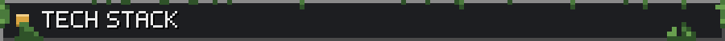</h2>

| Layer | Technology |
|---|---|
| Disease model | TensorFlow / Keras, DenseNet121 |
| Leaf detection | OpenCV HSV segmentation |
| Backend | Python 3.12, Flask, Flask-CORS |
| Frontend | Vanilla JS ES modules |
| 3D AR overlay | Three.js (orthographic, screen-space) |
| Dataset | PlantVillage (via Kaggle) |

<a id="quick-start"></a>
<h2>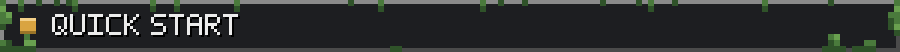</h2>

<a id="prerequisites"></a>
<h3>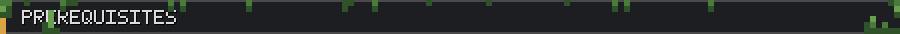</h3>

- Python 3.12
- Node.js (for `npm install`)
- A browser with camera access (Chrome/Firefox recommended)

<a id="1-clone"></a>
<h3>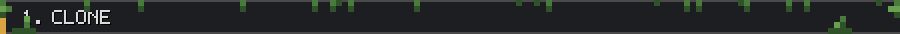</h3>

```bash
git clone https://github.com/thanmaiashok/AR-Plant-Health-Checker.git
cd AR-Plant-Health-Checker
```

<a id="2-backend-setup"></a>
<h3>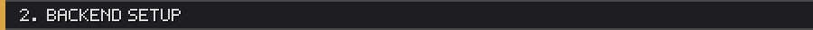</h3>

```bash
cd backend
python3.12 -m venv venv
./venv/bin/pip install -r requirements.txt
cd ..
```

<a id="3-frontend-setup"></a>
<h3>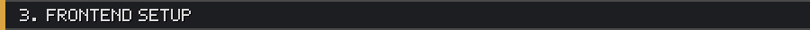</h3>

```bash
cd frontend
npm install
cd ..
```

<a id="4-run-both-services-in-one-command"></a>
<h3></h3>

```bash
./start.sh
```

Then open: **http://127.0.0.1:8080/public/index.html**

```bash
# Stop everything
./kill.sh
```

**Windows:**

```bat
start.bat
kill.bat
```

<a id="manual-startup"></a>
<h3>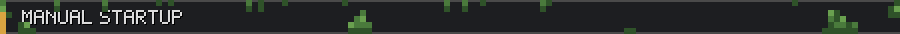</h3>

```bash
# Terminal 1 — backend (port 5001)
cd backend
PYTHONPATH=$(pwd) ./venv/bin/python api/server.py

# Terminal 2 — frontend (port 8080)
cd frontend
python3 -m http.server 8080 --bind 127.0.0.1
```

<a id="dataset"></a>
<h2></h2>

The model is trained on the **PlantVillage** dataset.  
Download from [Kaggle](https://www.kaggle.com/datasets/abdallahalidev/plantvillage-dataset) and place it at:

```
backend/dataset/PlantVillage/
```

Run training:

```bash
cd backend/training
../../venv/bin/python preprocess_data.py
../../venv/bin/python train_model.py
../../venv/bin/python evaluate_model.py
```

The trained model (`backend/models/plant_disease_model.keras`) is **included** in this repo (37 MB).

<a id="api-reference"></a>
<h2>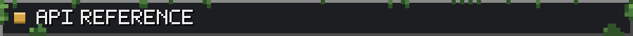</h2>

<a id="post-predict"></a>
<h3>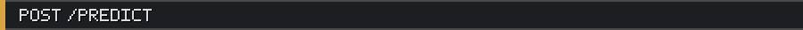</h3>

**Request:** `multipart/form-data` with field `image` (JPEG or PNG)

**Response:**
```json
{
  "disease": "Tomato_Early_blight",
  "confidence": 0.97,
  "recommendation": "Prune lower leaves and use mulch to reduce soil splash...",
  "leafBox": { "x": 0.20, "y": 0.10, "w": 0.50, "h": 0.60, "area": 0.30 },
  "leafContour": [{ "x": 0.21, "y": 0.11 }, "..."]
}
```

`leafBox` and `leafContour` are `null` when no leaf is detected.

<a id="get-health"></a>
<h3>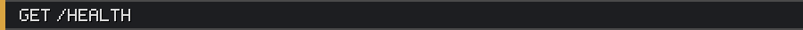</h3>

```json
{ "status": "ok" }
```

<a id="project-structure"></a>
<h2></h2>

```
AR-Plant-Health-Checker/
├── backend/
│   ├── api/            # Flask server + routes
│   ├── inference/      # Predict + leaf detection
│   ├── models/         # Trained .keras model + class indices
│   ├── training/       # Preprocessing, training, evaluation scripts
│   ├── utils/          # Image utils + recommendation engine
│   └── requirements.txt
├── frontend/
│   ├── public/         # index.html, favicon
│   └── src/
│       ├── ar/         # arCamera, arOverlay, ar3dOverlay
│       ├── components/ # ResultPanel, HealthIndicator
│       └── services/   # imageUpload, apiService
├── docs/               # Architecture diagram + reports
├── start.sh / start.bat
└── kill.sh  / kill.bat
```

<a id="contributing"></a>
<h2></h2>

Contributions are welcome. To get started:

1. Fork the repo
2. Create a feature branch: `git checkout -b feat/my-feature`
3. Commit with conventional commits: `git commit -m "feat: add X"`
4. Open a Pull Request

**Good first issues:**
- Add support for more plant species / disease classes
- Mobile PWA support
- WebRTC-based real-time streaming instead of polling
- Docker Compose setup

<a id="license"></a>
<h2></h2>

MIT — see [LICENSE](LICENSE).

<a id="acknowledgements"></a>
<h2>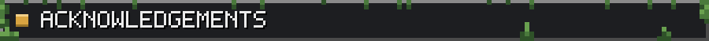</h2>

- [PlantVillage Dataset](https://www.kaggle.com/datasets/abdallahalidev/plantvillage-dataset) — Hughes & Salathé, 2015
- [Three.js](https://threejs.org/) — 3D WebGL library
- [TensorFlow / Keras](https://www.tensorflow.org/) — model training + inference

<p align="center"><a href="https://github.com/thanmaiashok"></a></p>
